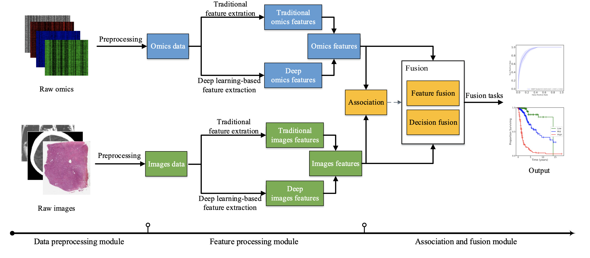

# Models
##### We provide the corresponding resources according to the modules of our paper, including data preprocessing, feature processing, association and fusion, datasets and performance comparison.

- Figure 1. Flowchart of omics-imaging fusion

---
# 1. Data Peprocessing 

## 1.1 Tools and methods for omics data preprocessing
- **K-nearest neighbor: Imputation method for the missing data.**  *[N. S. Altman, “An introduction to kernel and nearest-neighbor nonparametric regression,” The American Statistician, vol. 46, no. 3, pp. 175–185, 1992.](https://www.tandfonline.com/doi/abs/10.1080/00031305.1992.10475879)*
- **IMPUTE2: Imputation method for the missing data.**  *[Howie B N, Donnelly P, Marchini J. A flexible and accurate genotype imputation method for the next generation of genome-wide association studies[J]. PLoS genetics, 2009, 5(6): e1000529.](https://journals.plos.org/plosgenetics/article/metrics?id=10.1371/journal.pgen.1000529#citedHeader)*
- **mice package: Imputation method for the missing data.** *[van Buuren, S., and Groothuis-oudshoorn, K. (2011) mice: Multivariate Imputation by Chained Equations in R. J. Stat. Softw. 45, 1–67](https://www.jstatsoft.org/article/view/v045i03)*
- **MACH software: Imputation method for the missing data.**  *[Y. Li , C.J. Willer , J. Ding , P. Scheet , G.R. Abecasis , Mach: using sequence and genotype data to estimate haplotypes and unobserved genotypes, Genet. Epi- demiol. 34 (8) (2010) 816–834 .](https://onlinelibrary.wiley.com/doi/full/10.1002/gepi.20533)*
- **TMM: For data normalization.** *[M. D. Robinson and A. Oshlack, “A scaling normalization method for differential expression analysis of rna-seq data,” Genome biology, vol. 11, no. 3, pp. 1–9, 2010.](https://genomebiology.biomedcentral.com/articles/10.1186/gb-2010-11-3-r25)*
- **[DESeq2](http://www.bioconductor.org/packages/release/bioc/html/DESeq2.html): For data normalization.** *[ Love M, Huber W, Anders S. Moderated estimation of fold change and dispersion for RNA-Seq data with DESeq2. Genome Biology. 2014;](https://genomebiology.biomedcentral.com/articles/10.1186/s13059-014-0550-8)*
-  **[wateRmelon](https://www.bioconductor.org/packages/release/bioc/html/wateRmelon.html): For data transformation and normalization.**  *[Pidsley R, Wong C C Y, Volta M, et al. A data-driven approach to preprocessing Illumina 450K methylation array data[J]. BMC genomics, 2013, 14(1): 1-10.](https://bmcgenomics.biomedcentral.com/articles/10.1186/1471-2164-14-293)*

## 1.2 Tools and methods for imaging data preprocessing
#### -MRI 
 - **ITK-SNAP: Correction, skull stripping, image resampling.** *[P. A. Yushkevich, J. Piven, H. Cody Hazlett, R. Gimpel Smith, S. Ho, J. C. Gee, and G. Gerig, “User-guided 3D active contour segmentation of anatomical structures: Significantly improved efficiency and reliability,” Neuroimage, vol. 31, no. 3, pp. 1116–1128, 2006.](https://pubmed.ncbi.nlm.nih.gov/16545965/)*
 - **[FSL](http://fsl.fmrib.ox.ac.uk/fsl): Image segmentation (three tissues):gray matter, white matter, cerebrospinal fluid** 
 - **[FreeSurfer](https://surfer.nmr.mgh.harvard.edu/): Brain image processing and analysis** 
 - **[MIPAV software](https://mipav.cit.nih.gov/clickwrap.php): Anterior commissure- posterior commissure correction** 
 - **N3 algorithm:  Intensity inhomogeneity correction.** *[J. G. Sled, A. P. Zijdenbos, and A. C. Evans, “A nonparametric method for automatic correction of intensity nonuniformity in MRI data,” IEEE transactions on medical imaging, vol. 17, no. 1, pp. 87–97, 1998.](https://pubmed.ncbi.nlm.nih.gov/9617910/)*
 - **Brain surface extractor (BSE): Skull stripping.** *[D. W. Shattuck, S. R. Sandor-Leahy, K. A. Schaper, D. A. Rottenberg, and R. M. Leahy, “Magnetic resonance image tissue classification using a partial volume model,” NeuroImage, vol. 13, no. 5, pp. 856–876, 2001.](https://pubmed.ncbi.nlm.nih.gov/11304082/)*
 - **Brain extraction tool (BET): Skull stripping.** *[S. M. Smith, “Fast robust automated brain extraction,” Human Brain Mapping, vol. 17, no. 3, pp. 143–155, 2002.](https://pubmed.ncbi.nlm.nih.gov/12391568/)*
 - **HAMMER: Elastic registration.** *[D. Shen and C. Davatzikos, “HAMMER: hierarchical attribute matching mechanism for elastic registration,” in IEEE Workshop on Mathematical Methods in Biomedical Image Analysis, 2002.](https://ieeexplore.ieee.org/abstract/document/1175091)*
 
#### -fMRI
 - **[SPM](https://www.fil.ion.ucl.ac.uk/spm/) : Analysis of brain imaging data sequences.** 
 -  **[AFNI](http://afni.nimh.nih.gov/): Analysis and display of multiple MRI modalities.**
 -  **[FSL](http://fsl.fmrib.ox.ac.uk/fsl): A comprehensive library of analysis tools for brain imaging data.**
 -   **[REST](https://www.nitrc.org/projects/rest/):  A toolkit to calculate FC, ReHo, ALFF, fALFF, Gragner causality and perform statistical analysis.**
 -   **[DPARSF](http://rfmri.org/DPARSF): A convenient plug-in software within DPABI.**
 -  **[DPABI](http://rfmri.org/DPABI): a GNU/GPL toolbox for Data Processing & Analysis of Brain Imaging Histopathological images.**

#### -Histopathological images
- **Three-channel (RGB) histogram specification method: Imaging calibration and transformation.** *[Z. Ning, W. Pan, Y. Chen, Q. Xiao, X. Zhang, J. Luo, J. Wang, and Y. Zhang, “Integrative analysis of cross-modal features for the prognosis prediction of clear cell renal cell carcinoma,” Bioinformatics, vol. 36, no. 9, pp. 2888–2895, 2020.](https://pubmed.ncbi.nlm.nih.gov/31985775/)*
- **[HistomicsTK](https://github.com/DigitalSlideArchive/HistomicsTK): Histology image analysis.**

---

# 2.Feature Processing 
## 2.1 Traditional feature extraction methods for omics data in omics-imaging fusion
#### -Gene expression (mRNA expression)
- **EdgeR: Differential expression genes (DEGs) analysis.**  *[M. D. Robinson, D. J. McCarthy, and G. K. Smyth, “edgeR: a Bioconductor package for differential expression analysis of digital gene expression data,” Bioinformatics, vol. 26, no. 1, pp. 139–140, 2010.](https://pubmed.ncbi.nlm.nih.gov/19910308/)*
- **[DESeq2](http://www.bioconductor.org/packages/release/bioc/html/DESeq2.html): Differential expression genes (DEGs) analysis.**  *[ Love M, Huber W, Anders S. Moderated estimation of fold change and dispersion for RNA-Seq data with DESeq2. Genome Biology. 2014;](https://genomebiology.biomedcentral.com/articles/10.1186/s13059-014-0550-8)*
-  **WGCNA: Gene coexpression network analysis (GCNA).** *[P. Langfelder and S. Horvath, “WGCNA: an R package for weighted correlation network analysis,” BMC bioinformatics, vol. 9, no. 1, p. 559, 2008.](https://bmcbioinformatics.biomedcentral.com/articles/10.1186/1471-2105-9-559)*
-   **lmQCM: Gene coexpression network analysis (GCNA).** *[J. Zhang and K. Huang, “Normalized imqcm: An algorithm for detecting weak quasi-cliques in weighted graph with applications in gene co-expression module discovery in cancers,” Cancer informatics, vol. 13, p. CIN. S14021, 2014.](https://pubmed.ncbi.nlm.nih.gov/27486298/)*
-  **mRMR: A toolbox that uses the mutual information to extract features.** *[Ding C, Peng H. Minimum redundancy feature selection from microarray gene expression data[J]. Journal of bioinformatics and computational biology, 2005, 3(02): 185-205.](https://www.worldscientific.com/doi/abs/10.1142/s0219720005001004)*
-  **Polynomial KPCA: Dimensionality reduction.** *[Kokiopoulou E, Saad Y. PCA and kernel PCA using polynomial filtering: a case study on face recognition[J]. University of Minnesota, 2004.](https://www-users.cs.umn.edu/~saad/PDF/umsi-2004-213.pdf)*

#### -DNA methylation
- **KEGG: Using the KEGG database to extract features.** *[M. Kanehisa and S. Goto, “KEGG: kyoto encyclopedia of genes and genomes,” Nucleic acids research, vol. 28, no. 1, pp. 27–30, 2000.](https://academic.oup.com/nar/article/28/1/27/2384332?login=true)*
-  **mRMR: A toolbox that uses the mutual information to extract features.** *[Ding C, Peng H. Minimum redundancy feature selection from microarray gene expression data[J]. Journal of bioinformatics and computational biology, 2005, 3(02): 185-205.](https://www.worldscientific.com/doi/abs/10.1142/s0219720005001004)*

#### -SNPs
- **KEGG: Using the KEGG database to extract features.** *[M. Kanehisa and S. Goto, “KEGG: kyoto encyclopedia of genes and genomes,” Nucleic acids research, vol. 28, no. 1, pp. 27–30, 2000.](https://academic.oup.com/nar/article/28/1/27/2384332?login=true)*
- **[AlzGene](http://www.alzgene.org): Using the AlzGene database to extract features.**

 
## 2.2 Traditional feature extraction methods for imaging data in omics-imaging fusion
#### -MRI
- **Automated Anatomical Labeling (AAL): Identify regions of interest (ROI).** *[N. Tzourio-Mazoyer, B. Landeau, D. Papathanassiou, F. Crivello, O. Etard, N. Delcroix, B. Mazoyer, and M. Joliot, “Automated anatomical labeling of activations in spm using a macroscopic anatomical parcellation of the mni mri single-subject brain,” Neuroimage, vol. 15, no. 1, pp. 273–289, 2002.](https://www.sciencedirect.com/science/article/pii/S1053811901909784)*
- **Template: Identify regions of interest (ROI).** *[N. J. Kabani, D. J. Macdonald, C. J. Holmes, and A. C. Evans, “3D Anatomical Atlas of the Human Brain,” Neuroimage, vol. 7, no. 4, 1998.](https://www.sciencedirect.com/science/article/pii/S1053811918315507?dgcid=api_sd_search-api-endpoint)*
- **[3D Slicer](https://www.slicer.org/): Delineate lesion volumes.** 
-  **pyradiomics: Extract image statistics features.** *[J. J. M. van Griethuysen, A. Fedorov, C. Parmar, A. Hosny, N. Aucoin, V. Narayan, R. G. H. Beets-Tan, J.-C. Fillion-Robin, S. Pieper, and H. J. W. L. Aerts, “Computational Radiomics System to Decode the Radiographic Phenotype,” Cancer Research, vol. 77, no. 21, 2017.](https://pubmed.ncbi.nlm.nih.gov/29092951/)*
- **[FreeSurfer](https://surfer.nmr.mgh.harvard.edu/): Extract image statistics features.**

#### -CT
- **[DCMTK](https://support.dcmtk.org/): Obtain nodule masks.**
- **ITK-SNAP: Correction, skull stripping, image resampling.** *[P. A. Yushkevich, J. Piven, H. Cody Hazlett, R. Gimpel Smith, S. Ho, J. C. Gee, and G. Gerig, “User-guided 3D active contour segmentation of anatomical structures: Significantly improved efficiency and reliability,” Neuroimage, vol. 31, no. 3, pp. 1116–1128, 2006.](https://pubmed.ncbi.nlm.nih.gov/16545965/)*

#### -Histopathological images
- **The Digital Slide Archive: Identify regions of interest (ROI).** *[D. A. Gutman, M. Khalilia, S. Lee, M. Nalisnik, Z. Mullen, J. Beezley, D. R. Chittajallu, D. Manthey, and L. A. Cooper, “The digital slide archive: A software platform for management, integration, and analysis of histology for cancer research,” Cancer research, vol. 77, no. 21, pp. e75–e78, 2017.](https://www.ncbi.nlm.nih.gov/pmc/articles/PMC5898232/)*
- **Nucleus segmentation: Segment the nucleus.** *[H. A. Phoulady, D. B. Goldgof, L. O. Hall, and P. R. Mouton, “Nucleus segmentation in histology images with hierarchical multilevel thresholding,” in Medical Imaging 2016: Digital Pathology, 2016.](https://www.spiedigitallibrary.org/conference-proceedings-of-spie/9791/979111/Nucleus-segmentation-in-histology-images-with-hierarchical-multilevel-thresholding/10.1117/12.2216632.short)*
- **bftools: Crop images.** *[M. Linkert, C. T. Rueden, C. Allan, J.-M. Burel, W. Moore, A. Patterson, B. Loranger, J. Moore, C. Neves, D. MacDonald et al., “Metadata matters: access to image data in the real world,” Journal of Cell Biology, vol. 189, no. 5, pp. 777–782, 2010.](https://rupress.org/jcb/article/189/5/777/35828/Metadata-matters-access-to-image-data-in-the-real)*
-  **Otsu et al.: Extract densest tiles.** *[N. Otsu, “A threshold selection method from gray-level histograms,” IEEE transactions on systems, man, and cybernetics, vol. 9, no. 1, pp. 62–66, 1979.](https://ieeexplore.ieee.org/document/4310076)*
-  **ImageScope: Identify regions of interest (ROI).** *[C. Marinaccio and D. Ribatti, “A simple method of image analysis to estimate cam vascularization by aperio imagescope software,” International Journal of Developmental Biology, vol. 59, no. 4-5-6, pp. 217–219, 2015.](https://pubmed.ncbi.nlm.nih.gov/26505255/)*
-  **[OpenSlide](https://openslide.org/): Crop image, Extract image statistics features.**
-  **CellProfiler: Extract image statistics features.** *[A. E. Carpenter, T. R. Jones, M. R. Lamprecht, C. Clarke, I. H. Kang, O. Friman, D. A. Guertin, J. H. Chang, R. A. Lindquist, and J. Moffat, “CellProfiler: image analysis software for identifying and quantifying cell phenotypes,” Genome biology, vol. 7, no. 10, 2006.](https://genomebiology.biomedcentral.com/articles/10.1186/gb-2006-7-10-r100)*

---
# 3. Association and Fusion 
## 3.1 Omics-imaging Association
#### -For real-valued data
- **Pearson's correlation** *[X. Liao, B. Cai, B. Tian, Y. Luo, W. Song, and Y. Li, “Machine learning based radiogenomics analysis of features and metagenes in glioblastoma multiforme patients with different survival time,” Journal of Cellular and Molecular Medicine, vol. 23, no. 6, pp. 4375–4385, 2019.](https://onlinelibrary.wiley.com/doi/abs/10.1111/jcmm.14328)*
- **A multiple functional linear model (MFLM)**  *[J. Yao, X. Zhu, F. Zhu, and J. Huang, “Deep Correlational Learning for Survival Prediction from Multi-modality Data,” in Medical Image Computing and Computer-Assisted Intervention MICCAI 2017, M. Descoteaux, L. Maier-Hein, A. Franz, P. Jannin, D. L. Collins, and S. Duchesne, Eds., Cham, 2017, vol. 10434, pp. 406–414.](https://link.springer.com/chapter/10.1007/978-3-319-66185-8_46)*

#### -For category data
- **Fisher's exact test** *[C. A. Karlo, P. L. Di Paolo, J. Chaim, A. A. Hakimi, I. Ostrovnaya, P. Russo, H. Hricak, R. Motzer, J. J. Hsieh, and O. Akin, “Radiogenomics of clear cell renal cell carcinoma: associations between CT imaging features and mutations,” Radiology, vol. 270, no. 2, pp. 464–471, 2014.](https://pubs.rsna.org/doi/abs/10.1148/radiol.13130663)*
- **Spearman rank correlation coefficients** 
1. *[X. Zhan, J. Cheng, Z. Huang, Z. Han, B. Helm, X. Liu, J. Zhang, T.-F. Wang, D. Ni, and K. Huang, “Correlation Analysis of Histopathology and Proteogenomics Data for Breast Cancer,” Molecular & Cellular Proteomics, vol. 18, 2019.](https://www.mcponline.org/article/S1535-9476(20)32760-2/fulltext)*  **code:** https://github.com/xiaohuizhan/cor_image_omics_BRCA  **dataset:** *[TCGA](https://tcga-data.nci.nih.gov/tcga/.)* 
2. *[J. Cheng, J. Zhang, Y. Han, X. Wang, X. Ye, Y. Meng, A. Parwani, Z. Han, Q. Feng, and K. Huang, “Integrative Analysis of Histopathological Images and Genomic Data Predicts Clear Cell Renal Cell Carcinoma Prognosis,” Cancer Research, vol. 77, no. 21, 2017.](https://pubmed.ncbi.nlm.nih.gov/29092949/)* **code:** *https://github.com/chengjun583/image-mRNA-prognostic-model* 

#### -Network-based methods
- **A deep learning model** *[S. Li, H. Han, D. Sui, A. Hao, and H. Qin, “A Novel Radiogenomics Framework for Genomic and Image Feature Correlation using Deep Learning,” in 2018 IEEE International Conference on Bioinformatics and Biomedicine (BIBM), Madrid, Spain, Dec. 2018, pp. 899–906.](https://ieeexplore.ieee.org/abstract/document/8621432/)*
-  **A deep neural network pre-trained with an autoencoder and dropout** *[N. F. Smedley and W. Hsu, “Using deep neural networks for radiogenomic analysis,” in 2018 IEEE 15th International Symposium on Biomedical Imaging (ISBI 2018),Washington, DC, 2018, pp. 1529–1533.](https://ieeexplore.ieee.org/abstract/document/8363864/)*
## 3.2 Feature Fusion
### 3.2.1 Fusion through association
#### -CCA-based methods
- **GN-SCCA** *[L. Grosenick, B. Klingenberg, K. Katovich, B. Knutson, and J. E. Taylor, “Interpretable whole-brain prediction analysis with GraphNet,” NeuroImage, vol. 72, pp. 304–321, 2013.](https://www.sciencedirect.com/science/article/pii/S1053811912012487)*
- **AGN-SCCA** *[L. Du, H. Huang, J. Yan, S. Kim, S. L. Risacher, M. Inlow, J. H. Moore, A. J. Saykin, L. Shen, and f. t. A. D. N. Initiative, “Structured sparse canonical correlation analysis for brain imaging genetics: an improved GraphNet method,” Bioinformatics, vol. 32, no. 10, pp. 1544–1551, 2016.](https://academic.oup.com/bioinformatics/article/32/10/1544/1743372)*
- **A generalized nonconvex SCCA model** *[L. Du, K. Liu, X. Yao, J. Yan, S. L. Risacher, J. Han, L. Guo, A. J. Saykin, and L. Shen, “Pattern Discovery in Brain Imaging Genetics via SCCA Modeling with a Generic Non-convex Penalty,” Scientific Reports, vol. 7, no. 1, p. 14052, 2017.](https://www.nature.com/articles/s41598-017-13930-y)*
-  **ssCCA**  *[A.-R. Mohammadi-Nejad, G.-A. Hossein-Zadeh, and H. Soltanian-Zadeh, “Structured and sparse canonical correlation analysis as a brain-wide multi-modal data fusion approach,” IEEE transactions on medical imaging, vol. 36, no. 7, pp. 1438–1448, 2017.](https://ur.booksc.eu/book/64495622/4f1376)*
-  **SCCA+regression function** 
1. *[Y. Bai, Z. Pascal, W. Hu, V. D. Calhoun, and Y.-P. Wang, “Biomarker identification through integrating fmri and epigenetics,” IEEE Transactions on Biomedical Engineering, vol. 67, no. 4, pp. 1186–1196, 2019.](https://ieeexplore.ieee.org/abstract/document/8786218)*
2.  *[L. Du, K. Liu, X. Yao, S. L. Risacher, L. Guo, A. J. Saykin, and L. Shen, “Diagnosis Status Guided Brain Imaging Genetics Via Integrated Regression And Sparse Canonical Correlation Analysis,” in 2019 IEEE 16th International Symposium on Biomedical Imaging (ISBI 2019), 2019, pp. 356–359.](https://www.ncbi.nlm.nih.gov/pmc/articles/PMC6914314/)*
- **DSCCA** *[J. Yan, S. L. Risacher, K. Nho, A. J. Saykin, and L. Shen, “Identification of discriminative imaging proteomics associations in alzheimer’s disease via a novel sparse correlation model,” in Biocomputing 2017, 2016, pp. 94–104.](https://www.worldscientific.com/doi/abs/10.1142/9789813207813_0010)*
- **sMCCA**
1.  *[S.-P. Deng, W. Hu, V. D. Calhoun, and Y.-P. Wang, “Integrating imaging genomic data in the quest for biomarkers of schizophrenia disease,” IEEE/ACM transactions on computational biology and bioinformatics, vol. 15, no. 5, pp. 1480–1491, 2017.](https://www.computer.org/csdl/journal/tb/2018/05/08025561/14dcDXLXNjS)*
2.  *[W. Hu, D. Lin, V. D. Calhoun, and Y.-p. Wang, “Integration of SNPs-FMRI-methylation data with sparse multi-CCA for schizophrenia study,” in 2016 38th Annual International Conference of the IEEE Engineering in Medicine and Biology Society (EMBC), 2016, pp. 3310–3313.](https://ieeexplore.ieee.org/abstract/document/7591436)*
- **CaMCCo** *[A. Singanamalli, H. Wang, and A. Madabhushi, “Cascaded Multi-view Canonical Correlation (CaMCCo) for Early Diagnosis of Alzheimer’s Disease via Fusion of Clinical, Imaging and Omic Features,” Scientific Reports, vol. 7, no. 1, p. 8137, 2017.](https://www.nature.com/articles/s41598-017-03925-0)*
- **SCCA+ordinal information** *[W. Shao, K. Huang, Z. Han, J. Cheng, L. Cheng, T. Wang, L. Sun, Z. Lu, J. Zhang, and D. Zhang, “Integrative Analysis of Pathological Images and Multi-Dimensional Genomic Data for Early-Stage Cancer Prognosis,” IEEE Transactions on Medical Imaging, vol. 39, no. 1, pp. 99–110, 2020.](https://ieeexplore.ieee.org/abstract/document/8727966)*

#### -ICA-based methods
- **joint ICA** *[V. D. Calhoun, T. Adalı, K. A. Kiehl, R. Astur, J. J. Pekar, and G. D. Pearlson, “A method for multitask fmri data fusion applied to schizophrenia,” Human brain mapping, vol. 27, no. 7, pp. 598– 610, 2006.](https://onlinelibrary.wiley.com/doi/epdf/10.1002/hbm.20204)*
- **parallel ICA** 
1. *[J. Liu, G. Pearlson, A. Windemuth, G. Ruano, N. I. Perrone- Bizzozero, and V. Calhoun, “Combining fmri and snp data to investigate connections between brain function and genetics using parallel ica,” Human brain mapping, vol. 30, no. 1, pp. 241–255, 2009.](https://onlinelibrary.wiley.com/doi/abs/10.1002/hbm.20508)*
2. *[S. A. Meda, B. Narayanan, J. Liu, N. I. Perrone-Bizzozero, M. C. Stevens, V. D. Calhoun, D. C. Glahn, L. Shen, S. L. Risacher, A. J. Saykin et al., “A large scale multivariate parallel ica method reveals novel imaging–genetic relationships for alzheimer’s disease in the adni cohort,” Neuroimage, vol. 60, no. 3, pp. 1608–1621, 2012.](https://www.ncbi.nlm.nih.gov/pmc/articles/PMC3312985/)*
- **three-way parallel ICA** *[V. M. Vergara, A. Ulloa, V. D. Calhoun, D. Boutte, J. Chen, and J. Liu, “A three-way parallel ica approach to analyze links among genetics, brain structure and brain function,” Neuroimage, vol. 98, pp. 386–394, 2014.](https://www.ncbi.nlm.nih.gov/pmc/articles/PMC4141686/)*
- **ISCCA** *[Y. Zhang, P. Peng, Y. Ju, G. Li, V. D. Calhoun, and Y.-P. Wang, “Canonical correlation analysis of imaging genetics data based on statistical independence and structural sparsity,” IEEE journal of biomedical and health informatics, vol. 24, no. 9, pp. 2621–2629, 2020.](https://ieeexplore.ieee.org/abstract/document/8990142)*

#### -NMF-based methods
- **sparse NMF** *[H. Kim and H. Park, “Sparse non-negative matrix factorizations via alternating non-negativity-constrained least squares for microarray data analysis,” Bioinformatics, vol. 23, no. 12, pp. 1495– 1502, 2007.](https://academic.oup.com/bioinformatics/article/23/12/1495/225472?login=true)*
- **GSNMF**  *[X. Liu, H. Lu, and H. Gu, “Group Sparse Non-negative Matrix Factorization for Multi-Manifold Learning,” in Procedings of the British Machine Vision Conference 2011, Dundee, 2011, pp. 56.1– 56.11.](https://projet.liris.cnrs.fr/imagine/pub/proceedings/BMVC-2011/Paper_507/BMVC507_Abstract.pdf)*
- **JNMF** *[S. Zhang, C.-C. Liu, W. Li, H. Shen, P. W. Laird, and X. J. Zhou, “Discovery of multi-dimensional modules by integrative analysis of cancer genomic data,” Nucleic acids research, vol. 40, no. 19, pp. 9379–9391, 2012.](https://academic.oup.com/nar/article-abstract/40/19/9379/2414808)*
- **GSJNMF** *[M. Wang, T.-Z. Huang, J. Fang, V. D. Calhoun, and Y.-P. Wang, “Integration of imaging (epi) genomics data for the study of schizophrenia using group sparse joint nonnegative matrix factorization,” IEEE/ACM Transactions on Computational Biology and Bioinformatics, 2019.](https://ieeexplore.ieee.org/abstract/document/8642433/)*
- **GJNMFO** *[P. Peng, Y. Zhang, Y. Ju, K. Wang, G. Li, D. C. Vince, and Y.- P. Wang, “Group Sparse Joint Non-negative Matrix Factorization on Orthogonal Subspace for Multi-modal Imaging Genetics Data Analysis,” IEEE/ACM transactions on computational biology and bioinformatics, vol. PP, 2020.](https://ieeexplore.ieee.org/abstract/document/9106763)*
- **MCJNMF** *[J. Deng, W. Zeng, W. Kong, Y. Shi, X. Mou, and J. Guo, “Multi- Constrained Joint Non-Negative Matrix Factorization with Application to Imaging Genomic Study of Lung Metastasis in Soft Tissue Sarcomas,” IEEE Transactions on Biomedical Engineering, pp. 1–1, 2019.](https://ieeexplore.ieee.org/document/8908811)*
- **MDJNMF** *[J. Deng, W. Zeng, S. Luo, W. Kong, Y. Shi, Y. Li, and H. Zhang, “Integrating multiple genomic imaging data for the study of lung metastasis in sarcomas using multi-dimensional constrained joint non-negative matrix factorization,” Information Sciences, vol. 576, pp. 24–36, 2021.](https://www.sciencedirect.com/science/article/abs/pii/S0020025521006496)*

### 3.2.2 Direct Fusion
#### -Basic methods
- **Vector concatenation** 
1. *[X. Zhu, J. Yao, X. Luo, G. Xiao, Y. Xie, A. Gazdar, and J. Huang, “Lung cancer survival prediction from pathological images and genetic data: An integration study,” in 2016 IEEE 13th International Symposium on Biomedical Imaging (ISBI), 2016, pp. 1173– 1176.](https://ieeexplore.ieee.org/abstract/document/7493475/)*
2. *[K.-H. Yu, G. J. Berry, D. L. Rubin, C. RA˜ ©, R. B. Altman, and M. Snyder, “Association of Omics Features with Histopathology Patterns in Lung Adenocarcinoma,” Cell Systems, vol. 5, no. 6, pp. 620–627.e3, 2017.](https://www.sciencedirect.com/science/article/pii/S2405471217304842)*
3. *[H. Zeng, L. Chen, M. Zhang, Y. Luo, and X. Ma, “Integration of histopathological images and multi-dimensional omics analyses predicts molecular features and prognosis in high-grade serous ovarian cancer,” Gynecologic Oncology, 2021.](https://www.sciencedirect.com/science/article/pii/S0090825821005771)*
- **Vector addition or subtraction** *[S.-P. Deng, D. Lin, V. D. Calhoun, and Y.-P.Wang, “Schizophrenia genes discovery by mining the minimum spanning trees from multi-dimensional imaging genomic data integration,” in 2016 IEEE International Conference on Bioinformatics and Biomedicine (BIBM), 2016, pp. 1493–1500.](https://ieeexplore.ieee.org/abstract/document/7822743/)* 
- **Kronecker product** *[R. J. Chen, M. Y. Lu, J.Wang, D. F. K.Williamson, S. J. Rodig, N. I. Lindeman, and F. Mahmood, “Pathomic fusion: An integrated framework for fusing histopathology and genomic features for cancer diagnosis and prognosis,” IEEE Transactions on Medical Imaging, pp. 1–1, 2020.](https://ieeexplore.ieee.org/document/9186053)*

#### -Sparse representation
- **Group **
 *[H. Wang, F. Nie, H. Huang, S. L. Risacher, A. J. Saykin, L. Shen, and A. D. N. Initiative, “Identifying disease sensitive and quantitative trait-relevant biomarkers from multidimensional heterogeneous imaging genetics data via sparse multimodal multitask learning,” Bioinformatics, vol. 28, no. 12, pp. i127–i136, 2012.](https://academic.oup.com/bioinformatics/article-abstract/28/12/i127/269495)*
- **Lasso  with logistic regression** *[W. Guo, H. Li, Y. Zhu, L. Lan, S. Yang, K. Drukker, E. Morris, E. Burnside, G. Whitman, M. L. Giger, Y. Ji, and Tcga Breast Phenotype Research Group, “Prediction of clinical phenotypes in invasive breast carcinomas from the integration of radiomics and genomics data,” Journal of Medical Imaging, vol. 2, no. 4, p. 041007, 2015.](https://www.spiedigitallibrary.org/journals/journal-of-medical-imaging/volume-2/issue-4/041007/Prediction-of-clinical-phenotypes-in-invasive-breast-carcinomas-from-the/10.1117/1.JMI.2.4.041007.short)*
- **A robust self-representation loss function+a group sparsity regularization ()** *[X. Zhu, W. Zhang, Y. Fan, and Alzheimer’s Disease Neuroimaging Initiative, “A Robust Reduced Rank Graph Regression Method for Neuroimaging Genetic Analysis,” Neuroinformatics, vol. 16, no. 3, pp. 351–361, 2018.](https://link.springer.com/article/10.1007/s12021-018-9382-0)*
- **Group structured sparsity () + MKL** *[J. Peng, X. Zhu, Y. Wang, L. An, and D. Shen, “Structured sparsity regularized multiple kernel learning for Alzheimer’s disease diagnosis,” Pattern Recognition, vol. 88, pp. 370–382, 2019.](https://www.sciencedirect.com/science/article/pii/S0031320318304151)*
- **JMMLRC **  *[L. Brand, K. Nichols, H. Wang, L. Shen, and H. Huang, “Joint multi-modal longitudinal regression and classification for alzheimer’s disease prediction,” IEEE transactions on medical imaging, vol. 39, no. 6, pp. 1845–1855, 2019.](https://ieeexplore.ieee.org/abstract/document/8932589/)*
- **RIMMSRL** *[Z. Ning, Q. Xiao, Q. Feng, W. Chen, and Y. Zhang, “Relation-induced multi-modal shared representation learning for alzheimer’s disease diagnosis,” IEEE Transactions on Medical Imaging, vol. 40, no. 6, pp. 1632–1645, 2021.](https://ieeexplore.ieee.org/abstract/document/9366692/)*
- **SRVS algorithm** 
1. *[H. Cao, J. Duan, D. Lin, Y. Y. Shugart, V. Calhoun, and Y.-P.Wang, “Sparse representation based biomarker selection for schizophrenia with integrated analysis of fMRI and SNPs,” NeuroImage, pp. 220–228, 2014.](https://www.sciencedirect.com/science/article/pii/S1053811914000421)*
2. *[H. Cao, J. Duan, D. Lin, V. Calhoun, and Y.-P. Wang, “Integrating fMRI and SNP data for biomarker identification for schizophrenia with a sparse representation based variable selection method,” BMC Medical Genomics, vol. 6, no. 3, p. S2, 2013.](https://link.springer.com/article/10.1186/1755-8794-6-S3-S2)*

#### -MKL-based methods
- **SVM-RFE**  *[L. Maddalena, I. Granata, I. Manipur, M. Manzo, and M. R.Guarracino, “Glioma grade classification via omics imaging.” in BIOIMAGING, 2020, pp. 82–92.](https://www.researchgate.net/profile/Mario-Manzo-2/publication/339993776_Glioma_Grade_Classification_via_Omics_Imaging/links/5e85f36b4585150839b7af5b/Glioma-Grade-Classification-via-Omics-Imaging.pdf)*
- **MKL** *[C. Hinrichs, V. Singh, G. Xu, and S. Johnson, “Mkl for robust multi-modality ad classification,” in International Conference on Medical Image Computing and Computer-Assisted Intervention. Springer, 2009, pp. 786–794.](https://link.springer.com/chapter/10.1007/978-3-642-04271-3_95)*
- **GPMKL**  *[D. Sun, A. Li, B. Tang, and M. Wang, “Integrating genomic data and pathological images to effectively predict breast cancer clinical outcome,” Computer Methods and Programs in Biomedicine, vol. 161, pp. 45–53, 2018.](https://pubmed.ncbi.nlm.nih.gov/29852967/)*
- **simpleMKL** *[Z. Zhang, H. Huang, D. Shen, and A. D. N. Initiative, “Integrative analysis of multi-dimensional imaging genomics data for Alzheimer’s disease prediction,” Frontiers in aging neuroscience, vol. 6, p. 260, 2014.](https://www.frontiersin.org/articles/10.3389/fnagi.2014.00260/full#h3) | - | [ADNI](http://adni.loni.usc.edu/)*
- **HI-MKL** *[Y. Zhang, A. Li, J. He, and M. Wang, “A Novel MKL Method for GBM Prognosis Prediction by Integrating Histopathological Image and Multi-Omics Data,” IEEE Journal of Biomedical and Health Informatics, vol. 24, no. 1, pp. 171–179, 2020.](https://ieeexplore.ieee.org/abstract/document/8638511/)*
- ** MKL** *[R. Filipovych, S. M. Resnick, and C. Davatzikos, “Multi-kernel classification for integration of clinical and imaging data: Application to prediction of cognitive decline in older adults,” in International Workshop on Machine Learning in Medical Imaging, 2011, pp. 26–34.](https://link.springer.com/chapter/10.1007/978-3-642-24319-6_4)*
- ** MKL**  *[[J. Peng, L. An, X. Zhu, Y. Jin, and D. Shen, “Structured sparse kernel learning for imaging genetics based Alzheimer’s disease diagnosis,” in International Conference on Medical Image Computing and Computer-Assisted Intervention, 2016, pp. 70–78.](https://link.springer.com/chapter/10.1007/978-3-319-46723-8_9#Fn1)*
- **LSCDFS-MKL** *[A. Zhang, A. Li, J. He, and M. Wang, “LSCDFS-MKL: A multiple kernel based method for lung squamous cell carcinomas diseasefree survival prediction with pathological and genomic data,” Journal of Biomedical Informatics, vol. 94, p. 103194, 2019.](https://www.sciencedirect.com/science/article/pii/S1532046419301121)*

#### -DNNs-based methods
- **A three-stage deep neural learning model** *[T. Zhou, K.-H. Thung, X. Zhu, and D. Shen, “Effective feature learning and fusion of multimodality data using stage-wise deep neural network for dementia diagnosis,” Human Brain Mapping, vol. 40, no. 3, pp. 1001–1016, 2019.](https://onlinelibrary.wiley.com/doi/abs/10.1002/hbm.24428)*
- **A two-stage neural network** *[Z. Zhan, N. Hosseni, O. Poirion, M. Westerhoff, E.-Y. Choi, T. Ching, and L. Garmire, “Two-stage Neural-network based Prognosis Models using Pathological Image and Transcriptomic Data: An Application in Hepatocellular Carcinoma Patient Survival Prediction:,” in Proceedings of the 13th International Joint Conference on Biomedical Engineering Systems and Technologies, Valletta, Malta, 2020, pp. 296–301.](https://www.medrxiv.org/content/10.1101/2020.01.25.20016832v1.abstract)*
- **GSCNN** *[P. Mobadersany, S. Yousefi, M. Amgad, D. A. Gutman, J. S. Barnholtz-Sloan, J. E. VelA˜ ¡zquez Vega, D. J. Brat, and L. A. D. Cooper, “Predicting cancer outcomes from histology and genomics using convolutional networks,” Proceedings of the National Academy of Sciences, vol. 115, no. 13, pp. E2970–E2979, Mar. 2018](https://www.pnas.org/content/115/13/E2970.short)* **code:** https://github.com/PathologyDataScience/SCNN
- **Deep Model** *[J. Venugopalan, L. Tong, H. R. Hassanzadeh, and M. D. Wang, “Multimodal deep learning models for early detection of alzheimer’s disease stage,” Scientific reports, vol. 11, no. 1, pp. 1–13, 2021.](https://www.nature.com/articles/s41598-020-74399-w)*

#### -Others
- **SNF** *[S.-P. Deng, D. Lin, V. D. Calhoun, and Y.-P. Wang, “Predicting schizophrenia by fusing networks from SNPs, DNA methylation and fMRI data,” in 2016 38th Annual International Conference of the IEEE Engineering in Medicine and Biology Society (EMBC), 2016, pp. 1447–1450.](https://ieeexplore.ieee.org/abstract/document/7590981/)*
- **GSSL** *[Y. Bai, Z. Pascal, V. Calhoun, and Y.-P. Wang, “Optimized Combination of Multiple Graphs with Application to the Integration of Brain Imaging and (epi) Genomics Data,” IEEE Transactions on Medical Imaging, 2019.](https://ieeexplore.ieee.org/abstract/document/8926394/)*
- **BFPS** *[Z. Ning, W. Pan, Y. Chen, Q. Xiao, X. Zhang, J. Luo, J. Wang, and Y. Zhang, “Integrative analysis of cross-modal features for the prognosis prediction of clear cell renal cell carcinoma,” Bioinformatics, vol. 36, no. 9, pp. 2888–2895, 2020.](https://pubmed.ncbi.nlm.nih.gov/31985775/)*
- **An integrative Bayesian risk prediction model** [T. Chekouo, F. C. Stingo, M. Guindani, and K.-A. Do, “A Bayesian predictive model for imaging genetics with application to schizophrenia,” The Annals of Applied Statistics, vol. 10, no. 3, pp. 1547–1571, 2016.](https://projecteuclid.org/journals/annals-of-applied-statistics/volume-10/issue-3/A-Bayesian-predictive-model-for-imaging-genetics-with-application-to/10.1214/16-AOAS948.short)
- **A Bayesian hierarchical modeling approach** *[F. C. Stingo, M. Guindani, M. Vannucci, and V. D. Calhoun, “An integrative Bayesian modeling approach to imaging genetics,” Journal of the American Statistical Association, vol. 108, no. 503, pp. 876–891, 2013.](https://www.tandfonline.com/doi/abs/10.1080/01621459.2013.804409)*
- **ss-HMFSS** *[L. An, E. Adeli, M. Liu, J. Zhang, S.-W. Lee, and D. Shen, “A hierarchical feature and sample selection framework and its application for alzheimer’s disease diagnosis,” Scientific reports, vol. 7, no. 1, pp. 1–11, 2017.](https://www.nature.com/articles/srep45269)*

## 3.3 Decision Fusion
### 3.3.1 Ensemble learning
- **A hybrid machine learning method** *[H. Yang, J. Liu, J. Sui, G. Pearlson, and V. D. Calhoun, “A hybrid machine learning method for fusing fMRI and genetic data: combining both improves classification of schizophrenia,” Frontiers in human neuroscience, vol. 4, p. 192, 2010.](https://www.frontiersin.org/articles/10.3389/fnhum.2010.00192/full)*
- **A stacked generalization model** *[J. H. Phan, R. Hoffman, S. Kothari, P.-Y. Wu, and M. D. Wang, “Integration of multi-modal biomedical data to predict cancer grade and patient survival,” in 2016 IEEE-EMBS International Conference on Biomedical and Health Informatics (BHI), 2016, pp. 577–580.](https://ieeexplore.ieee.org/abstract/document/7455963/)*
- **Random Forest**
1.  *[H. Li, H. Zeng, L. Chen, Q. Liao, J. Ji, and X. Ma, “Integrative Analysis of Histopathological Images and Genomic Data in Colon Adenocarcinoma,” 2020.](https://www.frontiersin.org/articles/10.3389/fonc.2021.636451/full)*
2.   *[A. El-Nabawy, N. El-Bendary, and N. A. Belal, “A feature-fusion framework of clinical, genomics, and histopathological data for METABRIC breast cancer subtype classification,” Applied Soft Computing, vol. 91, p. 106238, 2020.](https://www.sciencedirect.com/science/article/pii/S1568494620301782)*
3.  *[L. Chen, H. Zeng, M. Zhang, Y. Luo, and X. Ma, “Histopathological image and gene expression pattern analysis for predicting molecular features and prognosis of head and neck squamous cell carcinoma,” Cancer Medicine, 2021.](https://onlinelibrary.wiley.com/doi/abs/10.1002/cam4.3965)*

---
# 4. Datasets
- **[The Cancer Genome Atlas (TCGA)](https://tcga-data.nci.nih.gov.)**
- **[The Cancer Imaging Archive (TCIA)](https://www.cancerimagingarchive.net/)**
- **[cBioportal](https://www.cbioportal.org)**
- **The NSCLC-Radiogenomics Dataset** *[S. Bakr, O. Gevaert, S. Echegaray, K. Ayers, M. Zhou, M. Shafiq, H. Zheng, J. A. Benson, W. Zhang, and A. N. Leung, “A radiogenomic dataset of non-small cell lung cancer,” Scientific data, vol. 5, no. 1, pp. 1–9, 2018.](https://www.nature.com/articles/sdata2018202)*
- **The Mayo Clinic** *[Z. Sun, L. Wang, B. W. Eckloff, B. Deng, Y. Wang, J. A. Wampfler, J. Jang, E. D. Wieben, J. Jen, M. You, and P. Yang, “Conserved recurrent gene mutations correlate with pathway deregulation and clinical outcomes of lung adenocarcinoma in never-smokers,” BMC Medical Genomics, vol. 7, no. 1, p. 486, 2014.](https://link.springer.com/article/10.1186/1755-8794-7-32)*
- **[The Mind Clinical Imaging Consortium(MCIC)](https://central.xnat.org/data/projects/MCIC)**
- **[The Alzheimer’s Disease Neuroimaging Initiative(ADNI)](http://www.adni-info.org)**
- **The Philadelphia Neurodevelopmental Cohort (PNC)** *[T. D. Satterthwaite, J. J. Connolly, K. Ruparel, M. E. Calkins, C. Jackson, M. A. Elliott, D. R. Roalf, R. Hopson, K. Prabhakaran, M. Behr et al., “The philadelphia neurodevelopmental cohort: A publicly available resource for the study of normal and abnormal brain development in youth,” Neuroimage, vol. 124, pp. 1115– 1119, 2016.](https://www.sciencedirect.com/science/article/pii/S1053811915002529)*

---
# 5. Performance comparison
## 5.1 Papers using  [ADNI](http://adni.loni.usc.edu/) dataset
1. **simpleMKL** *[Z. Zhang, H. Huang, D. Shen, and A. D. N. Initiative, “Integrative analysis of multi-dimensional imaging genomics data for Alzheimer’s disease prediction,” Frontiers in aging neuroscience, vol. 6, p. 260, 2014.](https://www.frontiersin.org/articles/10.3389/fnagi.2014.00260/full#h3) | - | [ADNI](http://adni.loni.usc.edu/)*
2.  ** MKL**  *[J. Peng, L. An, X. Zhu, Y. Jin, and D. Shen, “Structured sparse kernel learning for imaging genetics based Alzheimer’s disease diagnosis,” in International Conference on Medical Image Computing and Computer-Assisted Intervention, 2016, pp. 70–78.](https://link.springer.com/chapter/10.1007/978-3-319-46723-8_9#Fn1)*
3.  **Deep Model** *[J. Venugopalan, L. Tong, H. R. Hassanzadeh, and M. D. Wang, “Multimodal deep learning models for early detection of alzheimer’s disease stage,” Scientific reports, vol. 11, no. 1, pp. 1–13, 2021.](https://www.nature.com/articles/s41598-020-74399-w)*
4.  **Multilevel Logistic Regression with Structured Penalties** *[P. Lu, O. Colliot, A. D. N. Initiative et al., “Multilevel modeling with structured penalties for classification from imaging genetics data,” in Graphs in Biomedical Image Analysis, Computational Anatomy and Imaging Genetics. Springer, 2017, pp. 230–240.](https://link.springer.com/chapter/10.1007/978-3-319-67675-3_21)*
5.  **ss-HMFSS** *[L. An, E. Adeli, M. Liu, J. Zhang, S.-W. Lee, and D. Shen, “A hierarchical feature and sample selection framework and its application for alzheimer’s disease diagnosis,” Scientific reports, vol. 7, no. 1, pp. 1–11, 2017.](https://www.nature.com/articles/srep45269)*
6.  **CaMCCo** *[A. Singanamalli, H. Wang, and A. Madabhushi, “Cascaded Multi-view Canonical Correlation (CaMCCo) for Early Diagnosis of Alzheimer’s Disease via Fusion of Clinical, Imaging and Omic Features,” Scientific Reports, vol. 7, no. 1, p. 8137, 2017.](https://www.nature.com/articles/s41598-017-03925-0)*
7.  **DSCCA** *[J. Yan, S. L. Risacher, K. Nho, A. J. Saykin, and L. Shen, “Identification of discriminative imaging proteomics associations in alzheimer’s disease via a novel sparse correlation model,” in Biocomputing 2017, 2016, pp. 94–104.](https://www.worldscientific.com/doi/abs/10.1142/9789813207813_0010)*

## 5.2 Papers using  [TCGA](https://tcga-data.nci.nih.gov/tcga/.) dataset
1. **A deep survival learning model** *[C. Huang, A. Zhang, and G. Xiao, “Deep Integrative Analysis for Survival Prediction,” in Biocomputing 2018, Kohala Coast, Hawaii, USA, 2018, pp. 343–352.](https://www.worldscientific.com/doi/abs/10.1142/9789813235533_0032)* **cancers:** LUSC&GBM 
2. **Deep learning-based** *[A. Cheerla and O. Gevaert, “Deep learning with multimodal representation for pancancer prognosis prediction,” Bioinformatics, vol. 35, no. 14, pp. i446–i454, 2019.](https://academic.oup.com/bioinformatics/article/35/14/i446/5529139?login=true)* **cancers:** 20 different cancer types **code:** https://github.com/gevaertlab/MultimodalPrognosis
3.  **SCCA+ordinal information** *[W. Shao, K. Huang, Z. Han, J. Cheng, L. Cheng, T. Wang, L. Sun, Z. Lu, J. Zhang, and D. Zhang, “Integrative Analysis of Pathological Images and Multi-Dimensional Genomic Data for Early-Stage Cancer Prognosis,” IEEE Transactions on Medical Imaging, vol. 39, no. 1, pp. 99–110, 2020.](https://ieeexplore.ieee.org/abstract/document/8727966)* **cancers:** LUSC&KIRC&KIRP
4.  **Diagnosis-guided multi-modal feature selection method (DGM2FS)** *[W. Shao, T. Wang, Z. Huang, J. Cheng, Z. Han, D. Zhang, and K. Huang, “Diagnosis-guided multi-modal feature selection for prognosis prediction of lung squamous cell carcinoma,” in International Conference on Medical Image Computing and Computer-Assisted Intervention. Springer, 2019, pp. 113–121.](https://www.springerprofessional.de/en/diagnosis-guided-multi-modal-feature-selection-for-prognosis-pre/17255438)* **cancers:** lung squamous cell carcinoma(SCC)
5.  **GPMKL**  *[D. Sun, A. Li, B. Tang, and M. Wang, “Integrating genomic data and pathological images to effectively predict breast cancer clinical outcome,” Computer Methods and Programs in Biomedicine, vol. 161, pp. 45–53, 2018.](https://pubmed.ncbi.nlm.nih.gov/29852967/)* **cancers:** BRCA
6.  **Deep Learning-based** *[J. Hao, S. C. Kosaraju, N. Z. Tsaku, D. H. Song, and M. Kang, “PAGE-Net: Interpretable and Integrative Deep Learning for Survival Analysis Using Histopathological Images and Genomic Data,” in Biocomputing 2020, Kohala Coast, Hawaii, USA, 2019, pp. 355–366.](https://pubmed.ncbi.nlm.nih.gov/31797610/)*  **cancer:** GBM **code:** https://github.com/DataX-JieHao/PAGE-Net  
7.  **Kronecker product** *[R. J. Chen, M. Y. Lu, J.Wang, D. F. K.Williamson, S. J. Rodig, N. I. Lindeman, and F. Mahmood, “Pathomic fusion: An integrated framework for fusing histopathology and genomic features for cancer diagnosis and prognosis,” IEEE Transactions on Medical Imaging, pp. 1–1, 2020.](https://ieeexplore.ieee.org/document/9186053)* **cancers:** LGG&GBM **code:** https://github.com/mahmoodlab/PathomicFusion
8.  **BFPS** *[Z. Ning, W. Pan, Y. Chen, Q. Xiao, X. Zhang, J. Luo, J. Wang, and Y. Zhang, “Integrative analysis of cross-modal features for the prognosis prediction of clear cell renal cell carcinoma,” Bioinformatics, vol. 36, no. 9, pp. 2888–2895, 2020.](https://pubmed.ncbi.nlm.nih.gov/31985775/)* **cancers:** ccRCC **code:** https://github.com/zhang-de-lab/zhang-lab?%20from=singlemessage
9.  **LSCDFS-MKL** *[A. Zhang, A. Li, J. He, and M. Wang, “LSCDFS-MKL: A multiple kernel based method for lung squamous cell carcinomas diseasefree survival prediction with pathological and genomic data,” Journal of Biomedical Informatics, vol. 94, p. 103194, 2019.](https://www.sciencedirect.com/science/article/pii/S1532046419301121)* **cancers:** lung squamous cell carcinomas(SCC)
10.  **Deep learning-based** *[L. A. Vale Silva and K. Rohr, “Pan-Cancer Prognosis Prediction Using Multimodal Deep Learning,” in 2020 IEEE 17th International Symposium on Biomedical Imaging (ISBI), 2020, pp. 568–571.](https://ieeexplore.ieee.org/document/9098665)* **cancers:** Pancancer

## 5.3 Papers using  other datasets
- [V. Subramanian, M. N. Do, and T. Syeda-Mahmood, “Multimodal fusion of imaging and genomics for lung cancer recurrence prediction,” in 2020 IEEE 17th International Symposium on Biomedical Imaging (ISBI), 2020, pp. 804–808.](https://ieeexplore.ieee.org/abstract/document/9098545/) **cancers:** NSCLC  **code:** https://github.com/svaishnavi411/multimodal-recurrence **dataset:** *[S. Bakr, O. Gevaert, S. Echegaray, K. Ayers, M. Zhou, M. Shafiq, H. Zheng, J. A. Benson, W. Zhang, A. N. Leung, et al., “A radiogenomic dataset of non-small cell lung cancer,” Scientific data, vol. 5, pp. 180–202, 2018.](https://www.nature.com/articles/sdata2018202)*

